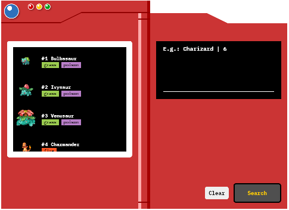

# Vue.js - *SPA* e *User Interface*

**Vue.js** é um framework Javascript open source muito utilizado na criação de *Single Page Aplications* como também no desenvolvolvimento de vários tipos de interfaces que possuam necessidades de maior interação e experiência para o usuário.

Nos dias de hoje, os websites estão cada vez melhores em termos de layout, navegação e reatividade mobile. Essa é justamente uma das utilidades do **Vue.js**: ser um framework robusto para criar aplicações web funcionais e agradáveis a quem utiliza.

Este repositório é a execução prática do curso de **Vue.js** disponibilizado pela plataforma [Digital Inovation One](https://digitalinnovation.one/) e ministrada pelo professor [Rafael Maia Chieregatto](https://github.com/rafaelmaiach). Uma excelente fonte de referência em UI.

Trata-se de uma Pokedex, uma espécie de enciclopédia eletrônica que fornece várias informações sobre os **Pokémons**, criaturas fictícias populares em videogames e desenhos. Este projeto, totalmente funcional, monta uma interface gráfica responsiva semelhante à original e que ao mesmo tempo faz consultas em uma API pública que fornece informações sobre as criaturas populares.



## Vue CLI

Para otimizar o processo de desenvolvimento de projetos o **Vue.js** proporciona uma interface **CLI** onde é possível executar diferentes funções comuns a projetos para front-end. 

### Para instalar o Vue CLI:
```
npm install -g @vue/cli
```

### Criando o novo projeto:
```
vue create <nome do projeto>
```

### Inatalação/atualização de dependências:

* AXIOS (requisições HTTP):  
```
npm i axios
```
* Infinite-loading:
```
npm i vue-infinite-loading
```
* No arquivo [package.json](./package.json) atualizar a versão do SASS Loader:  
```
sass-loader: ^10.0.2
```
* Atualizar projeto:
```
npm install
```
* Executar o projeto:
```
npm run serve
```